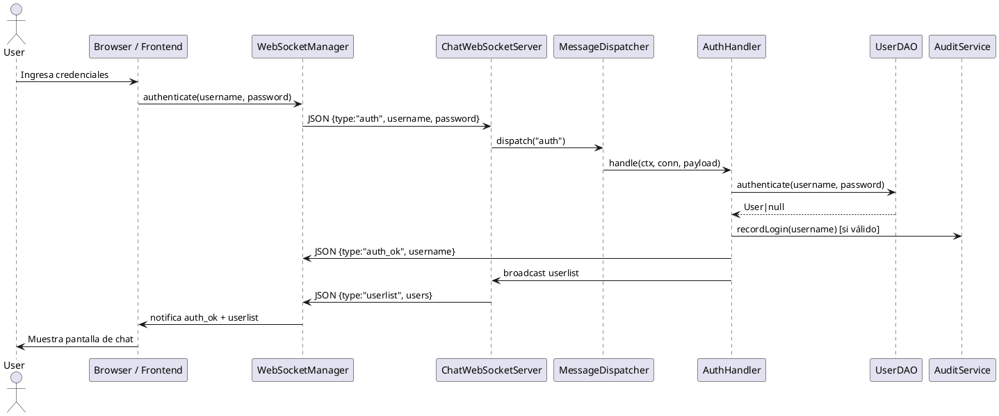
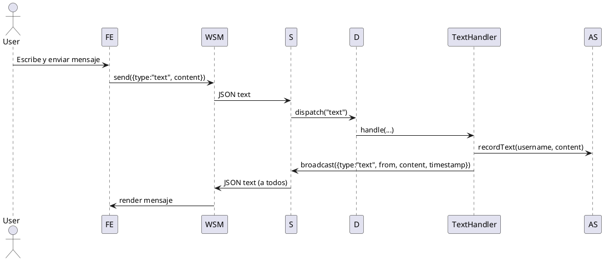
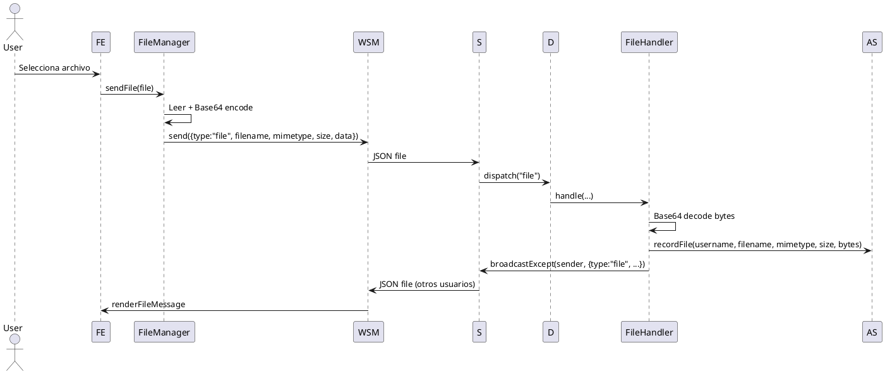
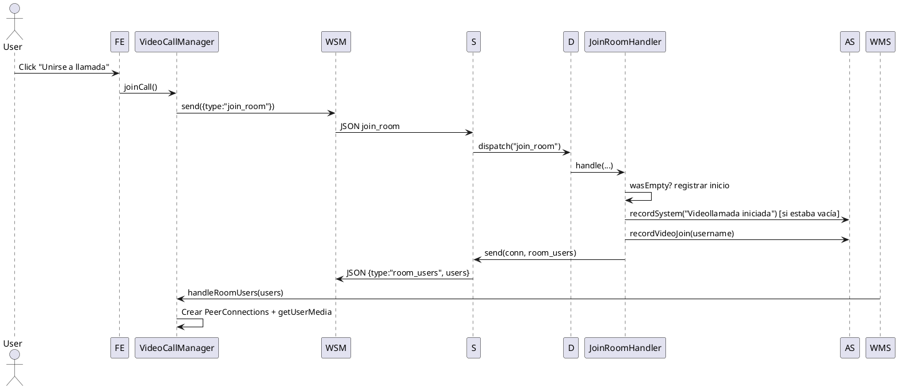
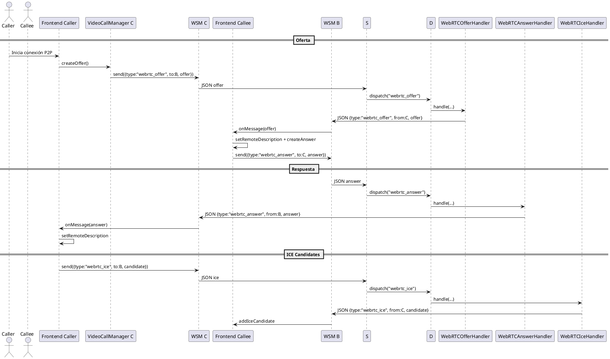

# NextTalk — Diagramas de Secuencia (UML)

Formato: PlantUML para integración rápida. Cada diagrama representa un flujo clave end-to-end entre Frontend (cliente), Servidor WebSocket y Servicios internos.

---
## 1. Autenticación (login)


---
## 2. Mensaje de texto


---
## 3. Transferencia de archivo


---
## 4. Videollamada: ingreso a sala


---
## 5. Señalización WebRTC (Oferta / Respuesta / ICE)


---
## Notas
- Todos los registros de auditoría (login, texto, archivo, video join/leave, sistema) se realizan exclusivamente a través de `AuditService`.
- Los diagramas omiten detalles de manejo de errores para claridad.
- Para nuevos tipos de mensaje, se agrega un handler y se registra en `ChatWebSocketServer.onStart()`.

---
## Exportación
Puedes usar PlantUML local o en línea:
```bash
# Ejemplo usando Docker
docker run --rm -v "$PWD":/workspace plantuml/plantuml -tpng SEQUENCE_DIAGRAMS.md
```

O copiar cada bloque `@startuml ... @enduml` a un archivo `.puml` y procesar.
